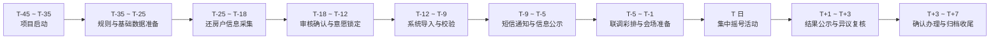

# XX项目还房活动总体时间线路

## 一、说明

本时间线路用于描述还房活动从项目启动到活动收尾归档的顶层推进节奏，便于项目统筹、部门协同和后续系统建设对齐。

为便于复用，本文采用 `T 日` 表示正式摇号活动日，前置准备和后续收尾均按 `T-天数`、`T+天数` 表达。实际执行时，可根据项目体量和审批周期整体前后平移。

建议整体准备周期控制在 `30-45 天`，如基础数据已较完整，可压缩至 `21-30 天`。

## 二、顶层时间线路

## 三、阶段安排

| 阶段 | 时间窗口 | 核心任务 | 形成成果 |
| --- | --- | --- | --- |
| 项目启动 | T-45 ~ T-35 | 成立工作专班，明确组织模式、职责分工、总体计划和活动日目标 | 项目启动会纪要、任务分工表、总排期表 |
| 规则与基础数据准备 | T-35 ~ T-25 | 梳理房源台账、还房户底册、房型分类、编号规则，形成采集口径和业务规则初稿 | 房源基础台账、住户底册、信息采集模板、规则初稿 |
| 还房户信息采集 | T-25 ~ T-18 | 采集住户身份信息、家庭信息、联系方式、代理信息、房型意愿等 | 信息采集表、房型意愿汇总表、问题清单 |
| 审核确认与意愿锁定 | T-18 ~ T-12 | 完成资格核验、重复校验、异常修正、住户确认签字，锁定最终参与名单和意愿数据 | 最终参与名单、意愿确认清单、异常处理记录 |
| 系统导入与校验 | T-12 ~ T-9 | 导入住户信息、房型意愿、房源数据，校验编码、轮次池、查询逻辑和结果输出格式 | 系统导入清单、校验报告、试跑结果 |
| 短信通知与信息公示 | T-9 ~ T-5 | 发送短信通知，发布活动公告、公示名单范围、告知时间地点材料和查询方式 | 短信发送记录、公示内容、通知回执 |
| 联调彩排与会场准备 | T-5 ~ T-1 | 完成全流程彩排、设备联调、二维码测试、会场布置、人员培训和应急预案检查 | 彩排记录、设备检查表、会场布置清单、应急预案 |
| 集中摇号活动 | T 日 | 签到核验、规则宣讲、数据封存确认、四轮摇号、扫码查询、现场答疑和异议登记 | 摇号结果表、候补顺序表、现场记录、影像资料 |
| 结果公示与异议复核 | T+1 ~ T+3 | 对摇号结果进行公示，受理异议申请，完成复核并形成处理意见 | 结果公示表、异议登记表、复核结论 |
| 确认办理与归档收尾 | T+3 ~ T+7 | 办理后续确认手续，整理纸电档资料，形成总结报告和归档文件 | 确认资料、归档目录、活动总结 |

## 四、里程碑节点

### 1. 项目正式启动

标志项目从构想到执行进入正式推进阶段，必须同步明确：

1. 谁负责数据。
2. 谁负责现场。
3. 谁负责系统。
4. 谁负责短信、公示和外部通知。

### 2. 房型意愿采集完成

这是整个活动最关键的业务输入节点。该节点之后，应尽快转入审核确认，避免意愿数据长时间反复变更。

### 3. 最终名单与意愿锁定

该节点是摇号活动的正式“封盘点”。一旦锁定，后续仅允许按异常处理流程修正，不再接受普通调整。

### 4. 系统导入校验通过

该节点标志业务数据已进入可执行状态。之后重点从“整理数据”转向“验证流程、保障稳定”。

### 5. 短信通知与公示发出

该节点标志活动进入公众可感知阶段，应确保通知内容统一、口径一致、可留痕、可复核。

### 6. 活动日完成四轮摇号

该节点是本次还房活动的核心成果节点，标志摇号主活动完成。

### 7. 结果公示和归档完成

该节点标志活动从执行阶段转入收尾阶段，为后续房号确认、审计检查和复盘优化提供依据。

## 五、建议的简约执行节奏

如果希望节奏更清晰、管理更省力，可以把整个项目理解为 `五段式推进`：

1. `启动段`：定规则、定组织、定时间。
2. `采集段`：收信息、收意愿、收确认。
3. `入库段`：做审核、做导入、做校验。
4. `实施段`：发通知、做公示、办活动。
5. `收尾段`：出结果、处理异议、做归档。

## 六、使用建议

这份时间线路适合作为以下材料的首页或附件：

1. 活动策划方案的总控页。
2. 项目周例会的推进底稿。
3. 各工作组的协同计划说明。
4. 后续系统需求梳理的业务主线参考。

如需进一步细化，下一步可继续拆成：

1. `按周推进版`：适合项目管理和汇报。
2. `按部门分工版`：适合责任到岗。
3. `按活动日前后 T 日版`：适合会务执行和落地。
